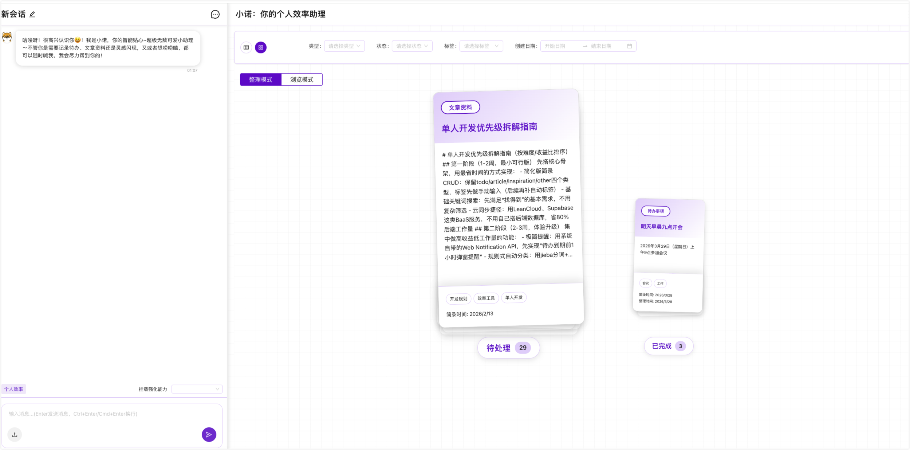

# 小诺智能助理 (XiaoNuo AI Assistant)

<p align="center">
  
</p>

<p align="center">
  <a href="https://github.com/noah-1106/xiaonuo-assistant/blob/main/LICENSE">
    
  </a>
  
  
  
</p>

<p align="center">
  <b>基于AI的智能清单记录和管理系统</b>
</p>

<p align="center">
  <a href="#功能特性">功能特性</a> •
  <a href="#技术栈">技术栈</a> •
  <a href="#快速开始">快速开始</a> •
  <a href="#部署指南">部署指南</a> •
  <a href="#贡献指南">贡献指南</a>
</p>

---

## 功能特性

- 🤖 **智能聊天**：基于火山方舟AI API，提供流畅的AI对话体验
- 🌐 **多标签页浏览器**：右侧集成多标签页浏览器，支持直接访问外部资源
- 📝 **简录管理**：智能创建、管理和搜索个人简录
- 💰 **套餐与支付**：支持套餐管理和微信支付功能
- 📱 **移动端适配**：支持移动端访问，提供良好的移动端体验
- 🔒 **安全认证**：基于JWT的用户认证系统
- 💾 **文件存储**：支持图片、视频、文档等多种文件类型的上传和处理
- 🔍 **Web搜索**：集成AI搜索功能，获取实时信息

## 技术栈

### 前端
- **框架**: React 19
- **构建工具**: Vite
- **UI组件**: Ant Design
- **状态管理**: React Context API
- **路由**: React Router
- **语言**: TypeScript

### 后端
- **运行时**: Node.js 20+
- **框架**: Express 4.x
- **数据库**: MongoDB 7.x
- **ORM**: Mongoose 8.x
- **认证**: JWT (jsonwebtoken)
- **AI服务**: 火山方舟AI API

### 基础设施
- **Web服务器**: Nginx
- **存储**: 火山方舟TOS
- **容器化**: Docker & Docker Compose

## 预览

### 登录后界面


### 登录前主页


## 项目结构

```
xiaonuo/
├── frontend/           # 前端代码
│   ├── src/
│   │   ├── components/  # React组件
│   │   ├── contexts/    # 状态管理
│   │   ├── pages/       # 页面
│   │   └── services/    # 服务
│   ├── public/          # 静态资源
│   └── package.json
├── backend/            # 后端代码
│   ├── src/
│   │   ├── controllers/ # 控制器
│   │   ├── models/      # 数据模型
│   │   ├── routes/      # 路由
│   │   ├── services/    # 服务
│   │   └── middleware/  # 中间件
│   └── package.json
├── docker-compose.yml  # Docker编排配置
└── README.md
```

## 快速开始

### 环境要求

- Node.js >= 20.0.0
- MongoDB >= 7.0
- pnpm >= 8.0（推荐）

### 1. 克隆项目

```bash
git clone https://github.com/noah-1106/xiaonuo-assistant.git
cd xiaonuo-assistant
```

### 2. 安装依赖

```bash
# 安装前端依赖
cd frontend
pnpm install

# 安装后端依赖
cd ../backend
pnpm install
```

### 3. 配置环境变量

```bash
# 后端配置
cd backend
cp .env.example .env
# 编辑 .env 文件，填入你的配置

# 前端配置
cd ../frontend
cp .env.example .env
# 编辑 .env 文件，填入你的配置
```

### 4. 启动开发服务器

```bash
# 启动后端（在backend目录）
pnpm run dev

# 启动前端（在frontend目录）
pnpm run dev
```

访问 http://localhost:5173 查看应用。

## 部署指南

详细的部署文档请查看 [DEPLOYMENT.md](./DEPLOYMENT.md)

### Docker部署（推荐）

```bash
# 使用Docker Compose启动
docker-compose up -d
```

### 手动部署

1. 构建前端
```bash
cd frontend
pnpm install
pnpm run build
```

2. 部署后端
```bash
cd backend
pnpm install --production
pnpm start
```

## API文档

### 健康检查
```http
GET /api/health
```

### 认证
```http
POST /api/auth/login-with-code
Content-Type: application/json

{
  "phone": "13800138000",
  "code": "123456"
}
```

### 聊天
```http
POST /api/chat/send
Authorization: Bearer <token>
Content-Type: application/json

{
  "message": "你好",
  "sessionId": "test-session"
}
```

更多API文档请参考 [API_DOCUMENTATION.md](./API_DOCUMENTATION.md)

## 环境变量说明

### 后端环境变量

| 变量名 | 说明 | 示例 |
|--------|------|------|
| `PORT` | 服务器端口 | 3001 |
| `MONGO_URI` | MongoDB连接字符串 | mongodb://localhost:27017/xiaonuo |
| `JWT_SECRET` | JWT密钥 | your-secret-key |
| `ARK_API_KEY` | 火山方舟API密钥 | your-api-key |
| `TOS_ACCESS_KEY_ID` | 火山引擎TOS Access Key | your-access-key |
| `WECHAT_APPID` | 微信支付AppID | wx... |

完整的环境变量说明请参考 [ENVIRONMENT.md](./ENVIRONMENT.md)

## 贡献指南

我们欢迎所有形式的贡献，包括但不限于：

- 提交Bug报告
- 提交功能请求
- 提交代码修复
- 改进文档

### 提交代码

1. Fork 本仓库
2. 创建你的特性分支 (`git checkout -b feature/AmazingFeature`)
3. 提交你的修改 (`git commit -m 'Add some AmazingFeature'`)
4. 推送到分支 (`git push origin feature/AmazingFeature`)
5. 打开一个 Pull Request

### 代码规范

- 使用 ESLint 进行代码检查
- 使用 Prettier 进行代码格式化
- 提交前运行测试

## 安全说明

- 请勿将敏感信息（API密钥、密码等）提交到版本控制
- 生产环境请使用HTTPS
- 定期更新依赖包以修复安全漏洞
- 妥善保管微信支付证书文件

## 许可证

本项目基于 [MIT](LICENSE) 许可证开源。

## 联系方式

- 邮箱：noah-tan@live.com
- 项目主页：https://github.com/noah-1106/xiaonuo-assistant

## 致谢

- [火山方舟](https://www.volcengine.com/product/ark) - AI服务支持
- [Ant Design](https://ant.design/) - UI组件库
- [React](https://react.dev/) - 前端框架
- [Express](https://expressjs.com/) - 后端框架

---

<p align="center">
  Made with ❤️ by 小诺团队
</p>
